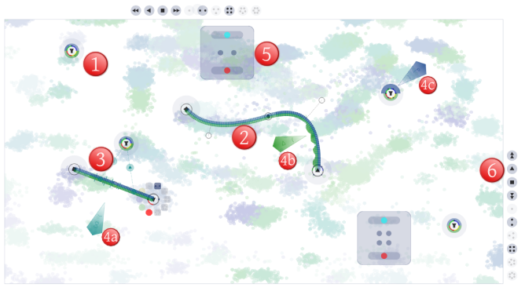

# SoundDesigner - Collaborative Sound Design Based on Perceptual Mapping 

")

This is the original source code for the prototypical sound design application in the 
publication:

Klügel, Niklas, and Becker, Timo, and Georg Groh. "Designing Sound Collaboratively-Perceptually Motivated Audio Synthesis"

Abstract:
In this contribution, we will discuss a prototype that allows a group of users to design sound collaboratively in real time using a multi-touch tabletop. We make use of a machine learning method to generate a mapping from perceptual audio features to synthesis parameters. This mapping is then used for visualization and interaction. Finally, we discuss the results of a comparative evaluation study.

which can be found here: http://www.nime.org/proceedings/2014/nime2014_339.pdf and http://arxiv.org/pdf/1406.6012 (extended version)

This application relies on a data set which has been published here as well, however the original sampling and timbre space construction method has not been released so far.
It is originally a tabletop application but the framework also allows use with mouse input apart from TUIO and native win7 touch.

Dependencies:
- reakt: https://github.com/lodsb/reakt
- UltraCom: https://github.com/lodsb/UltraCom
- the Vector phase distortion synth has to be installed (part of the repository)

- checkout and build + sbt publish for each of these

- The real-time audio synthesis uses SuperCollider / ScalaCollider, therefore an additional SuperCollider installation is necessary.
- External midi input to drive the synthesis algorithms
- Audio output device with multiple channels (for individial headphone outputs)

